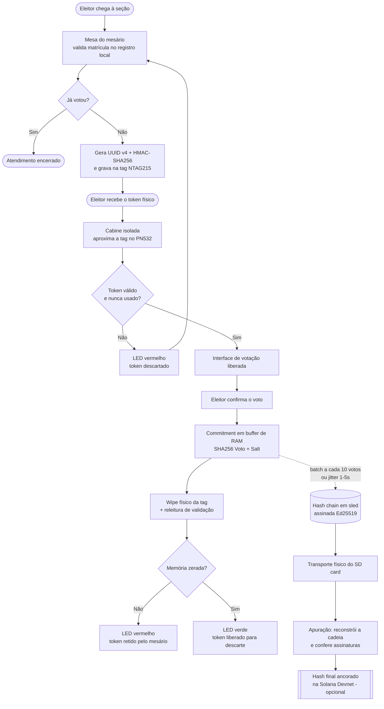
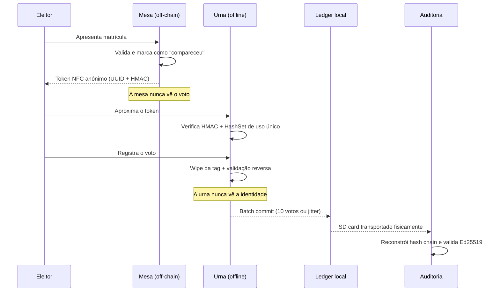

# 🗳️ EleiXan

**Urna universitária offline com token NFC descartável e blockchain privada local.**

> Integridade estrita e verificável dos votos — **sem** qualquer vínculo lógico ou físico com a identidade do eleitor.

[](https://www.colosseum.org/)
[]()
[]()
[]()
[]()
[]()

> **Escopo da entrega:** este hackathon entrega o **projeto no repositório** (código, arquitetura e documentação) e a **ilustração do fluxo ideal de uso e dos casos de uso**. Não há demonstração física da urna — o hardware está especificado, mas a validação é feita em **modo simulação**.

---

## 📌 O problema

Sistemas de e-voting sempre caem no mesmo dilema: para **provar** que um voto é válido, quase todos acabam guardando alguma ligação com quem votou. Sessões, logs, timestamps, tokens vinculados ao cadastro — qualquer um desses resíduos quebra o sigilo.

**EleiXan** separa fisicamente as duas responsabilidades:

| Camada | Sabe quem você é? | Sabe em quem você votou? |
|---|---|---|
| Mesa do mesário | ✅ Sim | ❌ Nunca |
| Urna / blockchain local | ❌ Nunca | ✅ Sim (apenas o commitment) |

Nenhuma das duas camadas, sozinha ou combinada, reconstrói o par `(eleitor, voto)`.

---

## ⚡ Como funciona — 5 passos

1. **Identificação (off-chain)** — O mesário valida a matrícula no registro local. O sistema gera um **UUID v4 de 128 bits** assinado com **HMAC-SHA256** e grava em uma tag física **NTAG215**. Nenhum dado do aluno vai para a tag.
2. **Voto anônimo** — O eleitor aproxima a tag do leitor **PN532** na urna isolada. A urna valida a assinatura e confirma, via `HashSet` em tempo real, que aquele token **nunca foi usado**.
3. **Registro na hash chain** — O voto vira um compromisso matemático encadeado:
   ```
   Block = Index + Prev_Hash + SHA256(Voto ‖ Salt) + Assinatura_Ed25519_Urna
   ```
4. **Reset com dupla confirmação** — A urna executa um wipe físico da tag e **relê a memória** para provar que zerou. LED verde = limpa. LED vermelho = descartar o token.
5. **Apuração e auditoria** — O cartão SD é transportado fisicamente ao fim do dia. A contagem reconstrói a cadeia de hashes e confere as assinaturas. Opcionalmente, o hash final é ancorado na **Solana Devnet** para prova pública de existência.

---

## 🔄 Fluxo ideal de uso (ilustrado)



### Separação de responsabilidades



---

## 🧩 Casos de uso

| ID | Ator | Caso de uso | Resultado esperado |
|---|---|---|---|
| UC-01 | Mesário | Habilitar eleitor e emitir token | Tag NTAG215 gravada com UUID assinado; comparecimento registrado off-chain |
| UC-02 | Eleitor | Votar na cabine isolada | Commitment do voto retido em RAM; token invalidado no `HashSet` |
| UC-03 | Urna | Invalidar token reutilizado | Voto recusado, LED vermelho, evento logado sem identidade |
| UC-04 | Urna | Executar wipe com dupla confirmação | Tag zerada e verificada por releitura; LED verde libera o descarte |
| UC-05 | Urna | Persistir votos em lote | Gravação na hash chain a cada 10 votos ou após jitter de 1–5 s |
| UC-06 | Urna | Sobreviver a queda de energia | `sled` recupera o log append-only sem perder commitments confirmados |
| UC-07 | Auditor | Apurar a eleição | Cadeia reconstruída, assinaturas Ed25519 conferidas, totais publicados |
| UC-08 | Auditor | Detectar adulteração | Qualquer bloco alterado quebra o encadeamento `prev_hash` e é apontado |
| UC-09 | Comunidade | Verificar prova pública | Hash final ancorado na Solana Devnet confere com o ledger local |
| UC-10 | QA | Simular timing attack | Correlação entre ordem de chegada e ordem dos blocos fica estatisticamente inviável |

### Fora de escopo

- Voto remoto ou pela internet.
- Identificação biométrica.
- Eleições oficiais ou reguladas por tribunais eleitorais.
- Demonstração física da urna nesta entrega — a validação é por simulação.

---

## 🛡️ Engenharia antifraude

### Dupla confirmação de reset NFC
A maioria dos projetos assume que um comando lógico de "limpar" basta. Aqui não:

- **Passo A** — escrita bruta de `0x00` em todos os setores da NTAG215.
- **Passo B** — releitura completa dos blocos apagados. Qualquer bit ≠ 0 → estado de exceção.
- **Passo C** — sinalização em hardware (LED verde/vermelho) para o mesário.

### Mitigação de timing attacks
Se alguém cronometrar quem entra na cabine e cruzar com o timestamp do bloco, o anonimato cai. Por isso a urna **não grava bloco a bloco**:

- Commitments ficam retidos em **buffer volátil de RAM**.
- A gravação permanente é em **lote (batch commit)**: a cada **10 votos** ou após um intervalo com **jitter aleatório de 1–5 s**.
- Resultado: a ordem cronológica de presença física deixa de corresponder à ordem dos registros digitais.

### Matriz de ataques × defesas

| Vetor de ataque | Defesa implementada | Garantia |
|---|---|---|
| Clonagem de tags NFC | Tokens UUID efêmeros validados contra `HashSet` persistente de uso único | HMAC-SHA256 assinado pela mesa |
| Adulteração pós-votação | Cada bloco encadeia o SHA256 do anterior | Imutabilidade da hash chain |
| Invasão / roubo da urna | Nenhum dado de identidade transita ou é salvo — só commitments | One-way hash commitment |
| Queda súbita de energia | Engine embarcada `sled` com log append-only | Garantia ACID local |

---

## 🧰 Stack

| Componente | Escolha |
|---|---|
| Linguagem core | **Rust** |
| Persistência | `sled` (embedded, append-only) |
| Serialização | `bincode` |
| Hash / assinatura | SHA-256, HMAC-SHA256, **Ed25519** |
| Tags NFC | **NTAG215** (descartáveis) |
| Leitor NFC | **PN532** (SPI/I²C) |
| Host | **Raspberry Pi 3B+ / 4** |
| Âncora pública (opcional) | **Solana Devnet** |

---

## 🚀 Rodando o projeto

```bash
git clone https://github.com/<org>/eleixan.git
cd eleixan

# build
cargo build --release

# testes (inclui simuladores de timing attack)
cargo test

# benchmark do core (meta: < 50 ms por bloco)
cargo bench
```

### Modo simulação — caminho principal desta entrega

Roda o fluxo completo (mesa → token → voto → wipe → batch commit → apuração) com o driver NFC emulado, sem nenhum hardware:

```bash
cargo run --release -- --mock-nfc --voters 870
```

### Modo urna (Raspberry Pi + PN532) — implementação de referência

Especificado e implementado no código, mas **não exercitado fisicamente** nesta entrega:

```bash
sudo cargo run --release -- --device /dev/spidev0.0 --station-key ./keys/urna.ed25519
```

### Apuração

```bash
cargo run --release --bin apurar -- --ledger /media/sd/ledger.db --verify-signatures
```

---

## 📁 Estrutura sugerida

```
eleixan/
├── crates/
│   ├── core/         # blocos, hash chain, commitments, sled
│   ├── nfc/          # driver PN532, wipe + validação reversa, LEDs
│   ├── mesa/         # emissão de tokens HMAC (off-chain)
│   ├── urna/         # binário da cabine
│   └── apuracao/     # reconstrução da cadeia e contagem
├── hardware/         # esquemáticos, lista de materiais, STLs
├── docs/             # SDD, ameaças, protocolo de auditoria
└── scripts/          # simuladores de ataque, carga, QA
```

---

## 📊 Referências acadêmicas

- **Blockchain-Based E-Voting Mechanisms: A Survey and a Proposal** — MDPI *Network*, 2024 (CC BY). Demonstra formalmente a viabilidade de infraestruturas de votação resilientes em nós restritos, especificamente o Raspberry Pi 3 Model B+.
- **A Solana-based decentralized e-voting system: Case Study at TASUED** — 2026. Estudo com 870 estudantes ativos; tempo médio de confirmação de 320–360 ms e consumo inferior a 0,00001 SOL por voto.
- **ElectAnon (2022)** e **HUJI Design Survey (2019)** — teorema da *Anonymity Universal* e uso de chaves efêmeras para desvincular o depósito criptográfico da computação do voto. Base lógica do token descartável.

### Lições do estado da arte

| Iniciativa | Lição |
|---|---|
| **Voatz** (análise do MIT) | Opacidade de caixa-preta é fatal; vulnerabilidades no app permitiam alteração de votos antes da rede. |
| **IIT Madras** (Índia, 2022) | Primeira eleição estudantil em blockchain da Ásia; transparência gera confiança real. |
| **ElectionGuard** (Microsoft) | Recibos criptográficos com salt permitem verificação independente pelo eleitor. |
| **Polyas / Helios** | A blockchain deve ser camada de auditoria *append-only* — nunca acoplada ao cadastro de identidade. |

---

## 👥 Equipe

| Função | Integrantes |
|---|---|
| Pesquisa & arquitetura | Marcelo Roberto da Silveira |
| Desenvolvimento Rust | 2 |
| Hardware NFC / Makers | 2 |
| QA & Auditoria | 1 |

---

## 🗓️ Cronograma do hackathon

| Dia | Responsável | Entregável |
|---|---|---|
| 1 | Pesquisa | SDD base e validação das fontes teóricas |
| 2 | Devs Rust | Structs de bloco, serialização `bincode`, benchmark < 50 ms |
| 3 | Makers NFC | Driver PN532 com rotina de wipe e LEDs + camada `--mock-nfc` equivalente |
| 4 | QA / Auditoria | Scripts de simulação de timing attacks e validação de integridade |
| 5 | Equipe | Fluxo ideal ilustrado, casos de uso e entrega do repositório |

---

## ⚠️ Escopo e isenção de responsabilidade

Este projeto é um **plano de pesquisa e desenvolvimento conceitual** para fins de demonstração acadêmica e competições de tecnologia. O sistema descrito **não substitui, não possui vínculo e não se aplica** a processos eleitorais oficiais de esferas governamentais ou regulamentados por tribunais eleitorais públicos.

A entrega do hackathon compreende o **repositório** e a **documentação do fluxo ideal e dos casos de uso**. As especificações de hardware descrevem a arquitetura pretendida e **não foram validadas em urna física**.

---

## 📄 Licença

A definir pela equipe (sugestão: **MIT** ou **Apache-2.0**).
